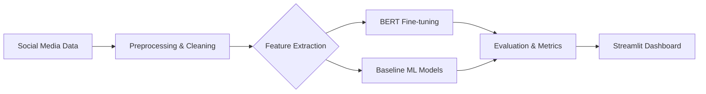

# 🧠 Mental Health Signal Detection from Social Media


**Mental Health NLP** is a sophisticated text classification system designed to detect psychological distress signals in social media posts (Reddit). The system categorizes content into five distinct mental health indicators: **Stress, Depression, Bipolar Disorder, Personality Disorder, and Anxiety.**

---

## 🌊 Pipeline Architecture & Flow



### 🔁 Operational Flow:
1.  **Data Acquisition:** Raw Reddit posts are processed from the Reddit Mental Health Dataset.
2.  **NLP Pipeline:** Text is cleaned (URL removal, lemmatization) using NLTK and spaCy.
3.  **Model Training:** A BERT model is fine-tuned for multi-class classification, achieving over 81% F1 Score.
4.  **Deployment:** Results are visualized through an interactive Streamlit dashboard for real-time analysis.

---

## 📊 Model Performance

| Model | Macro F1 Score | Status |
| :--- | :--- | :--- |
| **BERT (Fine-tuned)** | **81.06%** | ✅ Target achieved |
| Logistic Regression | 78.12% | Baseline |
| Naive Bayes | 75.08% | Baseline |

---

## 🛠️ Tech Stack

- **NLP Core:** PyTorch, HuggingFace Transformers (BERT), NLTK, spaCy.
- **Machine Learning:** Scikit-Learn (Logistic Regression, Naive Bayes).
- **Dashboard:** Streamlit, Plotly, Seaborn.
- **Data Handling:** Pandas, NumPy, Imbalanced-learn.

---

## 🚀 Setup & Installation

### 1. Prerequisites
- Python 3.10+
- Kaggle API Key (for dataset download)

### 2. Environment Setup
```bash
# Clone the repository
git clone https://github.com/Ashhadk7/Mental-Health-NLP.git
cd Mental-Health-NLP

# Create virtual environment
python -m venv venv
source venv/bin/activate  # Windows: venv\Scripts\activate

# Install dependencies
pip install -r requirements.txt
python -m spacy download en_core_web_sm
```

### 3. Data & Model Preparation
```bash
# Download dataset
python data_downloader.py

# Run preprocessing
python src/preprocessing.py
```

### 4. Run the Dashboard
```bash
streamlit run app/app.py
```

---

## 📁 Project Structure

```text
mental-health-nlp/
├── app/                    # Streamlit dashboard & UI logic
├── data/                   # Raw & Processed data (Gitignored)
├── models/                # Saved BERT & ML model weights
├── notebooks/             # Colab training notebooks
├── src/                   # Pipeline source code
│   ├── preprocessing.py   # Text cleaning & lemmatization
│   ├── features.py        # TF-IDF & Embedding extraction
│   └── evaluate_all.py    # Performance benchmarking
├── data_downloader.py     # Kaggle dataset utility
└── requirements.txt       # Project dependencies
```

---

## 👨‍💻 Author

**Muhammad Ashhad Khan**